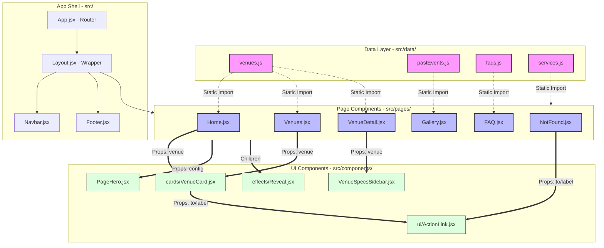
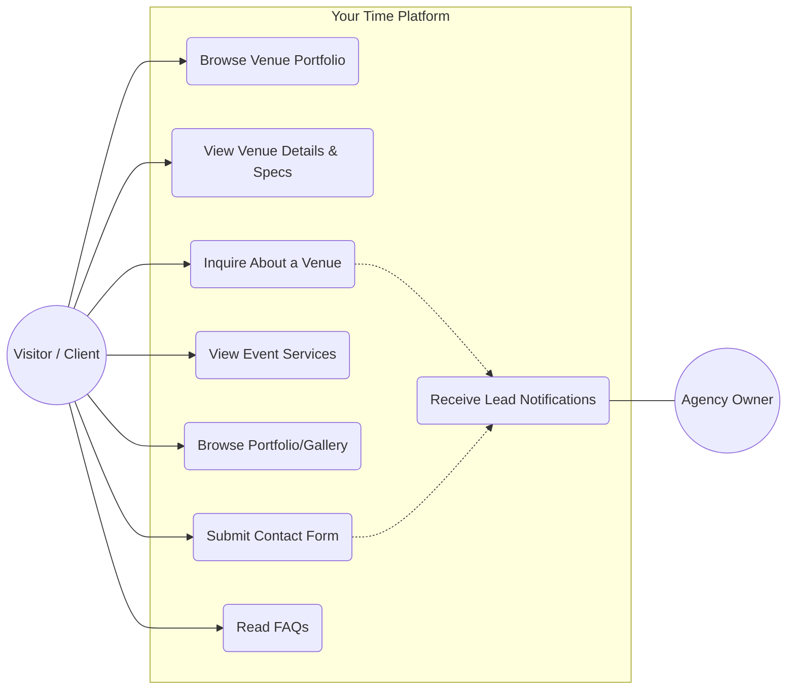

# System Architecture & Data Flow

This document outlines the component hierarchy and data flow for the "Your Time" project.

## Component Diagram (Mermaid)

## Architectural Breakdown

### 1. Data Layer (`src/data/`)
The single source of truth for the application's content. Data is stored as static JavaScript arrays/objects.
- **Responsibility:** Data definitions and exports.
- **Flow:** Imported directly by Page Components.

### 2. App Shell (`src/App.jsx`, `src/components/Layout.jsx`)
Handles routing and the persistent global UI.
- **`App.jsx`:** Maps URLs to Page Components using React Router.
- **`Layout.jsx`:** Manages the `Navbar`, `Footer`, and global behaviors (like scroll-to-top).

### 3. Page Components (`src/pages/`)
"Smart" container components that represent unique views.
- **Responsibility:** Fetching data from the Data Layer, managing local page state, and defining the layout using UI components.
- **Flow:** Passes specific data subsets (e.g., a single `venue` object) down to UI components via props.

### 4. UI Components (`src/components/`)
"Dumb" presentational components that are reusable across the app.
- **Responsibility:** Rendering the visual interface based on received props.
- **Flow:** Receive data via props; agnostic of where the data originated.

## Use Case Diagram

This diagram describes the primary interactions between the users (Actors) and the system.

### Primary Actors
- **Visitor / Client:** Couples or event planners looking for high-end spaces. Their goal is to discover a venue that fits their aesthetic and logistical needs.
- **Agency Owner:** The recipient of inquiries. Their goal is to receive qualified leads through the platform.

### Key Interactions
- **Discovery:** Users navigate the home and venue pages to explore the "Intentional Spaces" curated by the agency.
- **Validation:** Users check "Venue Details" (capacity, pricing) and "Services" to verify fit.
- **Conversion:** The primary goal is the "Inquiry" or "Contact Form" submission, which bridges the gap between the platform and the human agency services.
